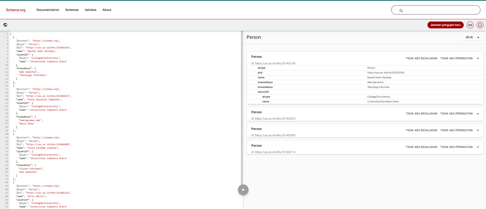
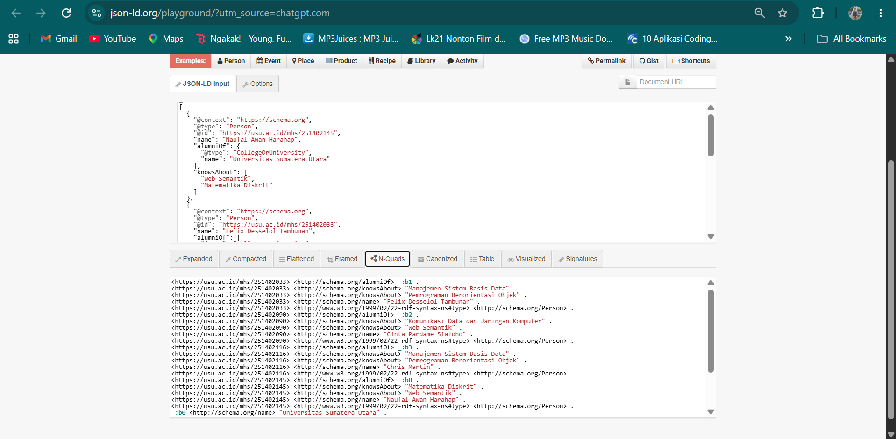

# Latihan Pertemuan 3 - JSON-LD dan Structured Data

## Identitas

| No. | Nama | NIM |
|---|---|---|
| 1 | Naufal Awan Harahap | 251402145 |
| 2 | Felix Desselol Tambunan | 251402033 |
| 3 | Cinta Pardame Sialoho | 251402090 |
| 4 | Chris Martin | 251402116 |

## Struktur Hasil

## 5. Hasil Validasi
Schema Markup Validator: profil_saya.jsonld berhasil diperiksa dan struktur data dikenali sebagai Person tanpa kesalahan sintaks.
Rich Results Test: seminar.html berhasil dikenali sebagai Event dan terdapat 1 item valid terdeteksi. Beberapa properti tambahan yang belum dicantumkan bersifat opsional.
JSON-LD Playground: profil_saya.jsonld berhasil diproses menjadi data terstruktur dan dapat menghasilkan bentuk RDF/N-Quads.

## 6. Refleksi**
Mengapa @context disebut jembatan menuju makna?
@context disebut jembatan menuju makna karena menghubungkan istilah yang digunakan dalam JSON-LD dengan kosakata yang memiliki arti tertentu, seperti Schema.org. Dengan demikian, mesin dapat memahami arti dari properti yang digunakan.
Apa perbedaan fungsi Schema Markup Validator dan Rich Results Test?
Schema Markup Validator digunakan untuk memeriksa apakah struktur dan properti data terstruktur sudah sesuai dengan kosakata Schema.org. Sedangkan Rich Results Test digunakan untuk memeriksa apakah data terstruktur pada halaman memenuhi persyaratan Google untuk menghasilkan fitur rich results pada hasil pencarian.
Mengapa isi JSON-LD harus sama dengan konten yang terlihat pada halaman?
Isi JSON-LD harus sesuai dengan konten yang terlihat agar data terstruktur benar-benar menggambarkan informasi pada halaman. Jika berbeda, data dapat menjadi tidak konsisten dan berpotensi memberikan informasi yang menyesatkan kepada mesin pencari.

## Bukti

