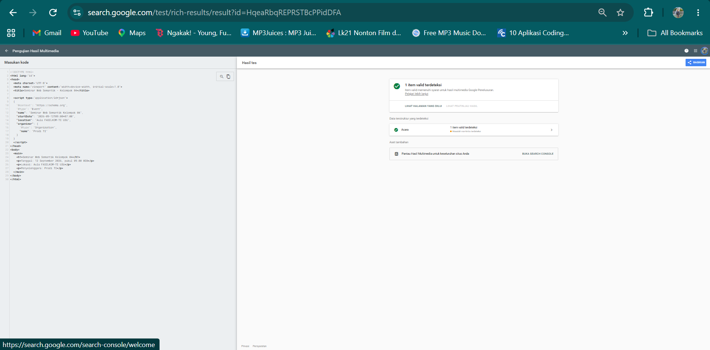

# Latihan Pertemuan 3 - JSON-LD dan Structured Data

## Identitas

| No. | Nama | NIM |
|-----|------|-----|
| 1 | Naufal Awan Harahap | 251402145 |
| 2 | Felix Desselol Tambunan | 251402033 |
| 3 | Cinta Pardame Sialoho | 251402090 |
| 4 | Chris Martin | 251402116 |

## Struktur Hasil

- `profil_saya.jsonld`
- `profil_perbaikan.jsonld`
- `seminar.html`
- folder `screenshots`

## 1. JSON Biasa dan JSON-LD

1. **Perbedaan fungsi kunci:**  
   Pada JSON biasa, kunci digunakan untuk menyimpan data sesuai kebutuhan aplikasi. Pada JSON-LD, properti seperti `name` mengikuti kosakata Schema.org sehingga data memiliki makna yang lebih terstruktur dan dapat dipahami oleh mesin.

2. **Fungsi `@context`, `@type`, dan `@id`:**  
   - `@context` menentukan kosakata atau konteks yang digunakan dalam JSON-LD.
   - `@type` menentukan jenis entitas yang dideskripsikan, misalnya `Person`.
   - `@id` memberikan identitas unik berupa IRI/URL kepada suatu entitas sehingga dapat dikenali dan dirujuk.

3. **Node tanpa `@id`:**  
   Node tanpa `@id` tetap dapat digunakan dalam JSON-LD, tetapi tidak mempunyai identitas global yang unik. Node tersebut dapat menjadi *blank node* sehingga tidak dapat dirujuk secara langsung menggunakan IRI/URL.

## 2. Pemeriksaan schema.org

1. **Alasan memilih tipe paling spesifik:**  
   Tipe yang paling spesifik dipilih agar jenis entitas dapat dijelaskan dengan lebih tepat. Dengan demikian, mesin dapat memahami konteks dan makna data secara lebih akurat.

2. **Nama properti dan bahasa nilai:**  
   Nama properti harus mengikuti kosakata Schema.org agar memiliki makna yang standar dan dapat dikenali oleh mesin. Sementara itu, nilai dari properti dapat menggunakan bahasa Indonesia karena merupakan informasi yang ingin disampaikan.

3. **Manfaat array pada `knowsAbout`:**  
   Array pada `knowsAbout` memungkinkan satu orang memiliki lebih dari satu bidang pengetahuan atau keahlian dalam satu properti tanpa harus menuliskan properti tersebut berulang kali.

## 3. Perbaikan Lima Kesalahan

| No. | Bagian Salah | Alasan | Perbaikan |
|-----|--------------|--------|-----------|
| 1 | `"@type": "person"` | Penulisan tipe Schema.org bersifat *case-sensitive* sehingga harus menggunakan kapitalisasi yang benar. | `"@type": "Person"` |
| 2 | `'name': "Rina Anggraini"` | Sintaks JSON menggunakan tanda kutip ganda (`"`) untuk nama properti. | `"name": "Rina Anggraini"` |
| 3 | `"birthDate": "12 September 2004"` | Nilai tanggal sebaiknya mengikuti format ISO 8601. | `"birthDate": "2004-09-12"` |
| 4 | `"nomorInduk": "221401001"` | `nomorInduk` bukan properti Schema.org yang digunakan dalam latihan ini. | `"identifier": "221401001"` |
| 5 | `"identifier": "221401001"` | Properti terakhir dalam objek JSON tidak boleh diakhiri dengan koma. | `"identifier": "221401001"` |

## 4. Triple dari JSON-LD Playground

Salah satu baris N-Quads yang terbentuk:

```text
<https://usu.ac.id/mhs/251402145> <https://schema.org/name> "Naufal Awan Harahap" .
```

## 5. Hasil Validasi

- **Schema Markup Validator:** Data pada `profil_saya.jsonld` berhasil diperiksa dan entitas `Person` dapat dikenali.
- **JSON-LD Playground:** Data pada `profil_saya.jsonld` berhasil diproses dan menghasilkan representasi RDF/N-Quads.
- **Rich Results Test:** Data pada `seminar.html` berhasil dikenali sebagai `Event` dan menghasilkan **1 item valid**. Beberapa properti tambahan yang belum dicantumkan bersifat opsional atau non-kritis.

## 6. Refleksi

1. **Mengapa `@context` disebut jembatan menuju makna?**  
   `@context` disebut jembatan menuju makna karena menghubungkan istilah yang digunakan dalam JSON-LD dengan kosakata yang memiliki arti tertentu, seperti Schema.org. Dengan demikian, mesin dapat memahami makna dari properti yang digunakan.

2. **Apa perbedaan fungsi Schema Markup Validator dan Rich Results Test?**  
   Schema Markup Validator digunakan untuk memeriksa apakah struktur, tipe, dan properti data terstruktur sesuai dengan Schema.org. Sementara itu, Rich Results Test digunakan untuk memeriksa apakah data terstruktur pada halaman dapat dikenali dan memenuhi persyaratan untuk fitur *rich results* pada Google.

3. **Mengapa isi JSON-LD harus sama dengan konten yang terlihat pada halaman?**  
   Isi JSON-LD harus sesuai dengan konten yang terlihat agar data terstruktur benar-benar menggambarkan informasi yang terdapat pada halaman. Hal ini menjaga konsistensi informasi yang diterima pengguna dan mesin pencari.

## Bukti

### Schema Markup Validator


### JSON-LD Playground


### Rich Results Test


